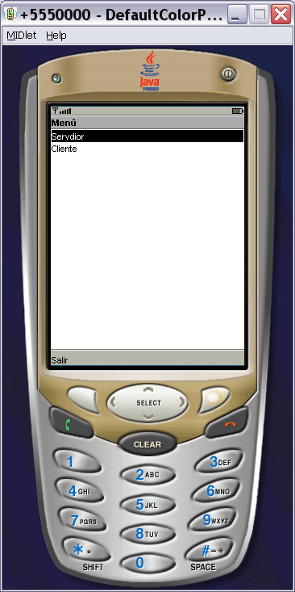
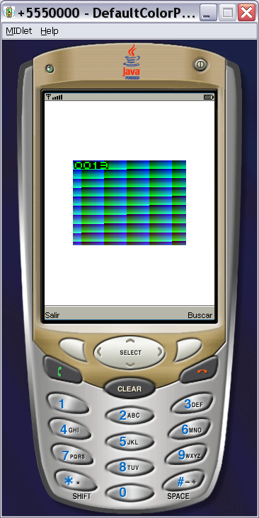
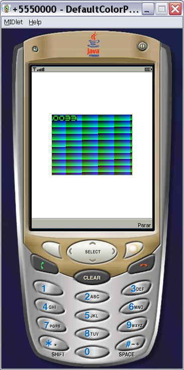

# Java ME Bluetooth Video Chat

Prototipo de videochat via Bluetooth para telefonos Java ME, desarrollado originalmente alrededor de 2006 para explorar comunicacion multimedia punto a punto sin usar Internet ni infraestructura celular de datos.

## El problema

En 2006, enviar audio, video o imagenes entre telefonos moviles sin depender de Internet, MMS o infraestructura celular de datos era limitado, costoso y muy dependiente del dispositivo. Muchos telefonos ya incluian Bluetooth y soporte Java ME, pero aprovecharlos para una comunicacion multimedia directa requeria probar APIs de camara, descubrimiento de dispositivos y conexiones punto a punto.

Este proyecto surge de esa necesidad: investigar si era posible construir una experiencia tipo videochat local entre telefonos cercanos usando Java ME y Bluetooth.

## La solucion

El repositorio contiene las piezas base de ese prototipo:

- Un MIDlet de camara que abre el visor, captura una imagen y la muestra en pantalla.
- Un par cliente/servidor Bluetooth SPP que descubre dispositivos cercanos, busca el servicio de puerto serie y envia datos entre telefonos.

La idea del sistema era combinar captura de camara y comunicacion Bluetooth para habilitar intercambio multimedia local. El codigo disponible conserva componentes de captura y comunicacion, aunque no incluye una implementacion completa y verificada de transmision continua de video en tiempo real.

## Funcionalidades principales

- Captura de imagen desde la camara con `Manager.createPlayer("capture://video")`.
- Vista previa de camara usando `VideoControl`.
- Descubrimiento de dispositivos Bluetooth cercanos.
- Busqueda de servicios Bluetooth SPP (`UUID 0x1101`).
- Envio y recepcion de datos mediante `StreamConnection`.
- Interfaz MIDP basada en `Canvas`, `List`, `TextBox`, `Command` y `Alert`.

## Que mejora este proyecto

El codigo conserva una exploracion practica de tecnologias moviles disponibles en 2006: camara local, descubrimiento Bluetooth y conexion cliente/servidor. Sirve como base educativa e historica para entender las restricciones de crear comunicacion multimedia directa entre telefonos antes de que el videochat por Internet fuera comun en smartphones.

## Para quien esta pensado

Esta pensado para estudiantes, docentes o personas que investigan aplicaciones moviles Java ME, comunicacion Bluetooth de corto alcance, APIs clasicas como JSR-82/MMAPI y prototipos moviles de mediados de la decada de 2000.

## Tecnologias utilizadas

- Java ME / J2ME.
- MIDP (`javax.microedition.midlet`, `javax.microedition.lcdui`).
- CLDC.
- JSR-82 Bluetooth (`javax.bluetooth`).
- Generic Connection Framework (`javax.microedition.io`).
- Mobile Media API (`javax.microedition.media`).

## Requisitos

No hay un archivo de build automatizado en el proyecto. Para compilar y ejecutar los MIDlets se requiere un entorno Java ME compatible, por ejemplo:

- JDK compatible con la herramienta Java ME utilizada.
- Java ME SDK, Wireless Toolkit o IDE con soporte MIDP/CLDC.
- APIs MIDP/CLDC, JSR-82 y MMAPI disponibles en el classpath del emulador o dispositivo.
- Un dispositivo o emulador con soporte Bluetooth para las clases SPP.
- Un dispositivo o emulador con soporte de camara para las clases de captura.

Las versiones exactas dependen del SDK Java ME elegido; este repositorio no fija una version mediante archivos de configuracion.

## Instalacion

```bash
git clone <url-del-repositorio>
cd memoria
```

Despues, importa los archivos `.java` en tu entorno Java ME o crea un proyecto MIDP nuevo y agrega las fuentes.

## Configuracion

El proyecto no necesita variables de entorno para funcionar. Se incluye `.env.example` solo como plantilla publica para futuras configuraciones sensibles.

No subas archivos `.env`, credenciales, claves privadas ni bases de datos locales al repositorio.

## Ejecutar el proyecto

Con un SDK Java ME, crea suites MIDlet separadas segun el ejemplo que quieras probar:

- Captura de camara: `CameraMIDlet`, `CameraCanvas`, `DisplayCanvas`.
- Servidor SPP: `SPPServidorMIDlet`, `SPPServidor`.
- Cliente SPP: `SPPClienteMIDlet`, `SPPCliente`, `Mensaje`.

El empaquetado final debe generar los archivos `.jar` y `.jad` desde tu herramienta Java ME. Esos artefactos son salidas de build y estan excluidos por `.gitignore`.

## Uso

Para la parte de camara, inicia `CameraMIDlet`, permite el acceso a la camara si el dispositivo lo solicita y usa el comando `Iniciar` o la tecla de accion para capturar una imagen.

Para la parte Bluetooth SPP, inicia primero `SPPServidorMIDlet` en el telefono receptor. En otro telefono inicia `SPPClienteMIDlet`, ejecuta `Busqueda`, selecciona el dispositivo encontrado, escribe el mensaje y confirma con `OK`.

## Estructura del proyecto

```text
.
|-- CameraMIDlet.java
|-- CameraCanvas.java
|-- DisplayCanvas.java
|-- SPPClienteMIDlet.java
|-- SPPCliente.java
|-- Mensaje.java
|-- SPPServidorMIDlet.java
|-- SPPServidor.java
|-- capitulo4.doc
`-- memoria.doc
```

## Capturas

### Menu



### Servidor y Cliente 




### Conexcion



## Seguridad

- No almacenes secretos, tokens ni contrasenas en el codigo fuente.
- Usa variables de entorno o configuracion local no versionada si en el futuro agregas integraciones externas.
- Manten `.env` fuera de Git y documenta solo placeholders en `.env.example`.
- Los documentos Word incluidos deben revisarse manualmente antes de publicar si contienen metadata personal o academica no deseada.

## Pruebas

No hay pruebas automatizadas configuradas. La validacion principal debe hacerse compilando los MIDlets en un entorno Java ME y ejecutandolos en emulador o dispositivo compatible.

## Estado del proyecto

Prototipo historico/educativo de 2006. El codigo muestra componentes de camara y Bluetooth SPP orientados a un videochat local, pero no incluye build automatizado ni una implementacion completa verificada de streaming de video en tiempo real.

## Limitaciones actuales

- No existe script de compilacion reproducible.
- La ejecucion depende de APIs Java ME que no estan incluidas en este repositorio.
- El codigo disponible conserva envio de datos/mensajes por SPP, pero no implementa transmision continua de video en tiempo real.
- El comportamiento de Bluetooth y camara depende del dispositivo, permisos y soporte del SDK.

## Proximas mejoras

- Agregar un archivo de build para Java ME.
- Documentar el empaquetado `.jad`/`.jar` con una herramienta especifica.
- Anadir pruebas manuales verificadas en un emulador o dispositivo real.
- Separar la documentacion academica en formato abierto o revisar/remover metadata antes de publicar.
- Integrar captura y envio de imagen/video para reconstruir el objetivo original de videochat Bluetooth.

## Contribuciones

Para contribuir, crea un fork, abre una rama con cambios acotados, valida la compilacion en un entorno Java ME compatible y envia un pull request explicando el cambio y la prueba realizada.

## Licencia

Este proyecto se distribuye bajo la licencia MIT. Consulta [LICENSE](LICENSE).
